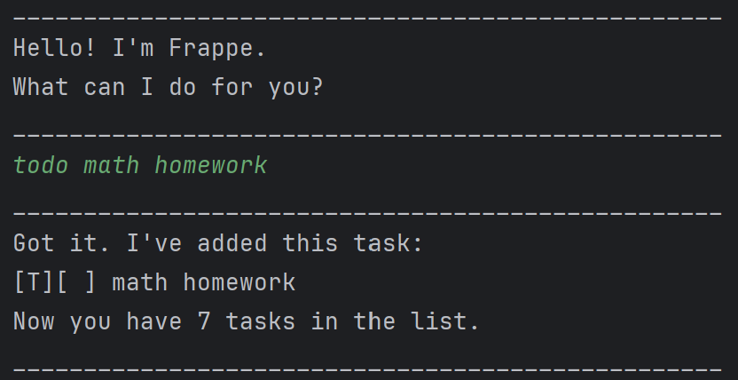

# Frappe User Guide



Frappe is a simple CLI chatbot that can be used to store simple tasks,
such as todos, deadlines and events.

Additionally, you can search for tasks, and mark them as completed.

When you're done adding tasks, your tasks are automatically saved and
ready for you when you start Frappe again.

## Quick Start

* Ensure you have Java 17 installed on your computer.
    * Download the latest `ip.jar` file [here](https://github.com/HTY2003/ip/releases)
* Copy the file to the folder you want to use as your home folder for Frappe.
* We recommend creating a dedicated folder for the file, as the program will create and store save files in the same
  folder
* Open a terminal, cd into your folder, and run the program using the command below:
    * ```java -jar ip.jar```
* You’re ready to start using Frappe!
* Refer to the Features and Command Summary below for more details on each command

## Adding todos using `todo`

You can add todo tasks using the `todo` command following the exact format stated below.

Format: `todo <name>`

Example: `todo math homework`

Expected Output:

```
__________________________________________________
Got it. I've added this task: 
[T][ ] math homework
Now you have 7 tasks in the list.
__________________________________________________
```

## Adding deadlines using `deadline`

You can add tasks with deadlines using the `deadline` command following the exact format stated below.

Format: `deadline <name> /by <deadline>`

Example: `deadline CS2113 ip /by midnight`

Expected Output:

```
__________________________________________________
Got it. I've added this task: 
[D][ ] CS2113 ip (by: midnight)
Now you have 8 tasks in the list.
__________________________________________________
```

## Adding events using `event`

You can add event tasks using the `event` command following the exact format stated below.

Format: `event <name> /from <start> /to <end>`

Example: `event open house /from 10am /to 6pm`

Expected Output:

```
__________________________________________________
Got it. I've added this task: 
[E][ ] open house (from: 10am to: 6pm)
Now you have 9 tasks in the list.
__________________________________________________
```

## Track task completion using `mark` and `unmark`

You can set tasks as completed (or undo this action) using the task numbers and the `mark` and `unmark` commands shown
below.

Format: `mark <task_number>`, `unmark <task_number>`

Example: `mark 1`, `unmark 3`

Expected Output:

```
__________________________________________________
Nice! I've marked this task as done:
[D][X] CS2113 ip (by: midnight)
__________________________________________________
```

```
__________________________________________________
OK, I've marked this task as not done yet:
[E][ ] open house (from: 10am to: 6pm)
__________________________________________________
```

## Removing tasks using `delete`

You can also permanently delete tasks from your list using the task number and the `delete` command as shown below.

Format: `delete <task_number>`

Example: `delete 1`

Expected Output:

```
__________________________________________________
Got it. I've removed this task: 
[T][ ] math homework
Now you have 2 tasks in the list.
__________________________________________________
```

## Displaying all tasks using `list`

You can list all the tasks using the `list` command!

Tasks are shown in the order they are added,
followed by a task type indicator (`T`odo, `D`eadline or `E`vent),
their completion status (`[X]` means done), and the task itself.

Format: `list`

Expected Output:

```
__________________________________________________
Here are the tasks in your list:
1. [D][ ] CS2113 ip (by: midnight)
2. [E][ ] open house (from: 10am to: 6pm)
3. [T][ ] math homework
__________________________________________________
```

## Finding tasks using `find`

Too many tasks?

Using the `find` command, you can search for all tasks that contain your search term in their print
output (the information you see when you use `list`).

Format: `find <search_term>`

Example: `find work`

Expected Output:

```
__________________________________________________
Here are the matching tasks in your list:
1. [T][ ] math homework
__________________________________________________
```

## Ending program using `bye`

To exit the program, use the `bye` command.

Always try to use this command to exit the program, or your save data may be corrupted!

Format: `bye`

Expected Output:

```
__________________________________________________
Bye. Hope to see you again soon!
__________________________________________________
```

## Command Summary

* `todo <name>`:
* `deadline <name> /by <deadline>`
* `event <name> /from <start> /to <end>`
* `delete <task_number>`
* `mark <task_number>`
* `unmark <task_number>`
* `list`
* `find <search_term>`
* `bye`

Thank you for reading!